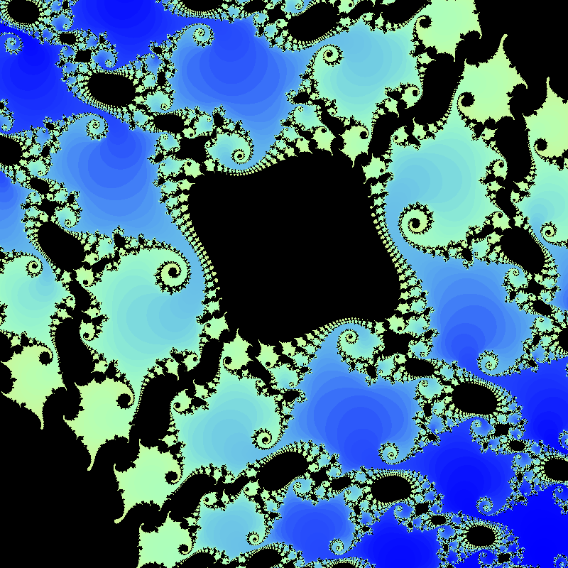
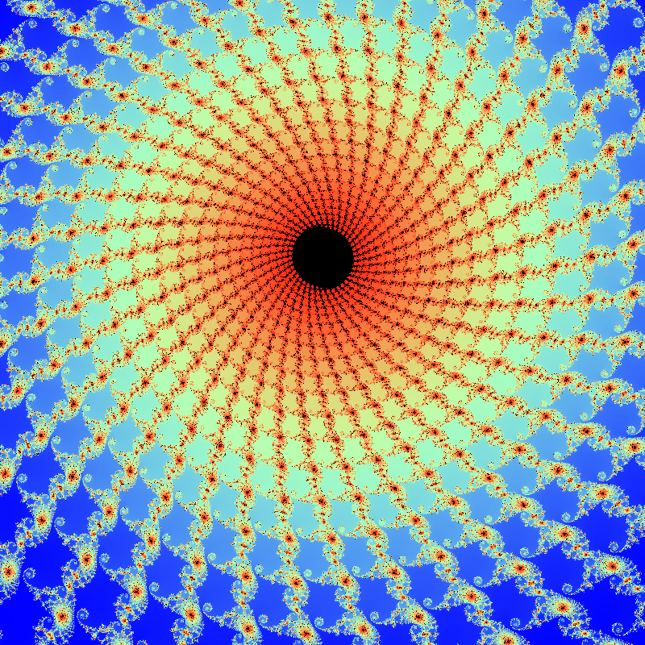

**Due**: Tuesday, December, 12th by 11:59 PM

Getting Started
===============

Download [CS201\_Assign06.zip](CS201_Assign06.zip) and import it into your Eclipse workspace (**File&rarr;Import&rarr;General&rarr;Existing projects into workspace&rarr;Archive file**.)

You should see a project called **CS201\_Assign06** in the Package Explorer. Your will be making changes to the **ColorMappingColorChooser** class. You will also be adding test cases to the **ColorMappingColorChooserTest** class.  You should add any additional classes or methods needed to complete the assignment.

Your Task
=========

Your task is to implement a color chooser for the [Mandelbrot Set](http://en.wikipedia.org/wiki/Mandelbrot_set) renderer from [CS201 Assignment 5](assign05.html).

Here are a of couple of images captured from the Mandelbrot Set rendered using the color map you will be implementing for this assigmment (click to see larger versions):

> 
> 

You will be creating a class that will be called from a supplied rendering program.  You will be able to use the rendering program to test your color mapping implementation, and explore the Mandelbrot Set.  The program allows zooming in by dragging the mouse, and zooming back out by clicking the right mouse button.

You will also be adding JUnit test cases to thoroughly test the color mapping class.  Expected values for each of the three methods you are to implement are supplied, along with JUnit test cases for you to use as examples for the additional test cases you need to provide.

If you have implemented the color mapping class correctly, the initial rendering of the full Mandelbrot Set, from (-2,2) to (2,-2), will look like this, based on an 800 x 800 image, and maximum iteration count of 2000 (click to see a larger version):

> 

Refer back to [CS201 Assignment 5](assign05.html) for the description and details for the Mandelbrot Set.

ColorMappingColorChooser class
--------------
The **ColorMappingColorChooser** class has been supplied.  Your task is to finish implementing the following three methods.  Additional implementation details are provided below.


	public TreeMap<Integer, Integer> createIterCountMap(int[][] iterCounts) {
        // Run through the iterCounts array passed to the method, and create
        // a map of the distinct iterCount values, along with the number of
        // occurrences of each iterCount value.  This Map will be used to
        // create the iterSpectrumMap

        // TODO: supply implementation here...

        // now we have a mapping of each iterCount with its respective frequency
		return iterCountMap;
    }

    public HashMap<Integer, Integer> createIterSpectrumMap(int[][] iterCounts) {
        // Run through the iterCountMap, and calculate the relative location
        // of each unique iterCount within the Color Spectrum, and map that
        // location to each iterCount from the iterCountMap.  This is not the
        // Color, but rather the position in the Color Spectrum for each
        // iterCount value.  This Map will be used to create the iterColorMap.

        // TODO: supply implementation here...		

        // now we have a mapping for each iterCount to its respective
        // location in the color spectrum
		return iterSpectrumMap;
    }

    public HashMap<Integer, Color> createIterColorMap(int[][] iterCounts) {
        // Run through the iterSpectrumMap and calculate the RGB color values
        // based on each iterCount's relative spectrum location from the
        // iterSpectrum Map.  This will map the iterCounts from iterCountMap
        // to RGB color values

        // TODO: supply implementation here...	

        // now we have a mapping from each distinct iterCount to its respective
        // Color, based on its relative frequency of occurrence
		return iterColorMap;		
    }
}


You will need to think about what fields to add and how to implement each operation.

Once your **Complex** class is ready, you can iterate the equation as follows:


z = z.multiply(z).add(c);


This assumes that you have variables **z** and **c** that refer to instances of the **Complex** class.

Creating a task class
---------------------

You should create a task class that computes the iteration counts for a region of the image.

Here is a suggested skeleton:


public class MandelbrotTask implements Runnable {
    private double x1, y1, x2, y2;
    private int startCol, endCol, startRow, endRow;
    private int[][] iterCounts;

    public MandelbrotTask(double x1, double y1, double x2, double y2,
                          int startCol, int endCol, int startRow, int endRow,
                          int[][] iterCounts) {
        this.x1 = x1;
        this.y1 = y1;
        this.x2 = x2;
        this.y2 = y2;
        this.startCol = startCol;
        this.endCol = endCol;
        this.startRow = startRow;
        this.endRow = endRow;
        this.iterCounts = iterCounts;
    }

    public void run() {
        for (int i = startRow; i < endRow; i++) {
            for (int j = startCol; j < endCol; j++) {
                Complex c = getComplex(i, j);
                int iterCount = computeIterCount(c);
                iterCounts[i][j] = iterCount;
            }
        }
    }

    // TODO: implement getComplex and computeIterCount methods
}


The idea is that a **MandelbrotTask** object will compute iteration counts for the region of the image with rows from **startRow** (inclusive) to **endRow** (exclusive) and columns from **startCol** (inclusive) to **endCol** (exclusive). The region of the complex plane is specified by **x1**, **y1**, **x2**, and **y2**.  The **iterCounts** array is the single global array used to store the iteration counts for the overall image (where the first dimension is rows and the second dimension is columns).

From the **main** method, you could use a **MandelbrotTask** object to compute all of the iteration counts as follows:


int[][] iterCounts = new int[HEIGHT][WIDTH];
MandelbrotTask task = MandelbrotTask(x1, y1, x2, y2, 0, WIDTH, 0, HEIGHT, iterCounts);
task.run();


Note that this approach is purely sequential, and will not take advantage of multiple CPU cores.

Rendering the Mandelbrot Set
============================

Rendering the Mandelbrot set is done by assigning a color to sampled points in a region of the x/y plane.

Points that are in the Mandelbrot set should be rendered as black.

Points that are outside the Mandelbrot set should be rendered using a color that indicates how many times the equation was iterated before the magnitude of Z reached 2.0. In my implementation, purple is used for points where the magnitude of Z reached 2.0 in 1 iteration. Then, as higher numbers of iterations are needed for the magnitude of Z to reach 2.0, my renderer chooses colors that transition smoothly from purple, to blue, to green, to yellow, to orange, and last to red (for points that are very close to the set, but not within it.)

You may choose any assignment of colors to numbers of iterations, as long as the each color is based on the number of iterations.

So, the 600 by 600 image you render will pick sample points uniformly spaced in a 600 by 600 grid which overlays the region of the x/y plane specified by the user, and set an image color for each corresponding pixel based on whether or not the point is in the set, and if not, how many iterations were required to show that it is not in the set.

Rendering An Image, Saving It
=============================

The Java **BufferedImage** class allows you to render an image:


BufferedImage bufferedImage = new BufferedImage(WIDTH, HEIGHT, BufferedImage.TYPE_INT_ARGB);
Graphics g = bufferedImage.getGraphics();

// ... use g to perform drawing operations ...

g.dispose();


Once the image has been rendered into the **BufferedImage** object, you can write it to a file as follows:


OutputStream os = new BufferedOutputStream(new FileOutputStream(fileName));
try {
    ImageIO.write(bufferedImage, "PNG", os);
} finally {
    os.close();
}


JUnit Test Cases
===========

Under the **junit** folder included with the project is the skeleton for creating the JUnit test cases for this assignment.  The test set-up has been provided for you, including a complete set of expected results for the three Maps that you will be creating.  The first test case has also been provided as an example for creating the test cases for the other two methods.

Grading Criteria
================

Your submission will be graded according to the following criteria:

- createIterCountMap:             20%
- createIterSpectrumMap:          20%
- createIterColorMap:             20%
- createIterSpectrumMapTest:      15%
- createIterColorMapTest:         15%
- Design, coding style, comments: 10%

Extra Credit
-------------------

For up to 25 points of extra credit, implement an additional color mapping that maps the existing iterCounts uniformly across the color spectrum.  In other words, rather than distributing them based on their relative size, with larger iterCount entries being allocated a wider region of the color spectrum, allocate the same portion of the spectrum to each existing iterCount in the iterCountMap.

To get the full credit, you will also have to implement a full set of test cases for each new method that you create.

<b>Important</b>: Make sure that you have the original assignment fully working before taking on the extra credit portion.

Submitting
==========

Save the project (**CS201\_Assign06**) to a zip file by right-clicking it and choosing

> **Export...&rarr;Archive File**

Upload the saved zip file to the Marmoset server as **assign06**. The server URL is

> <https://cs.ycp.edu/marmoset/>
